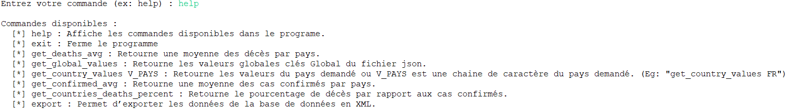
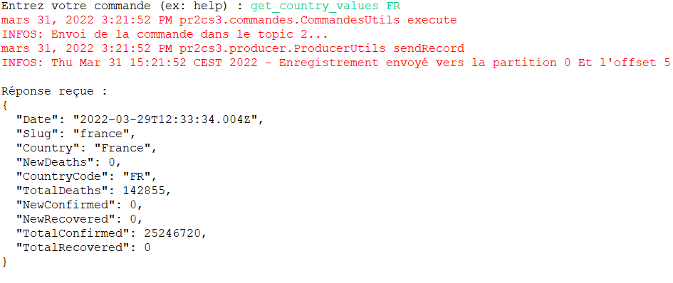
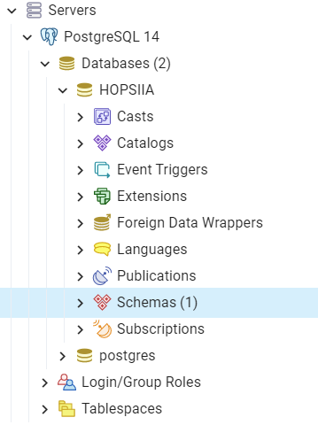
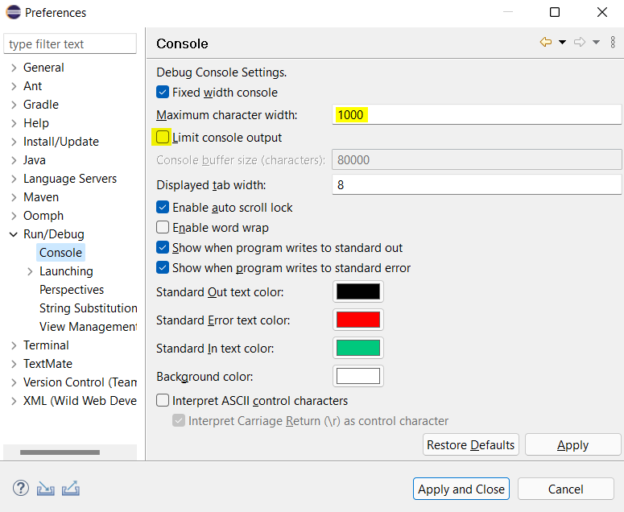
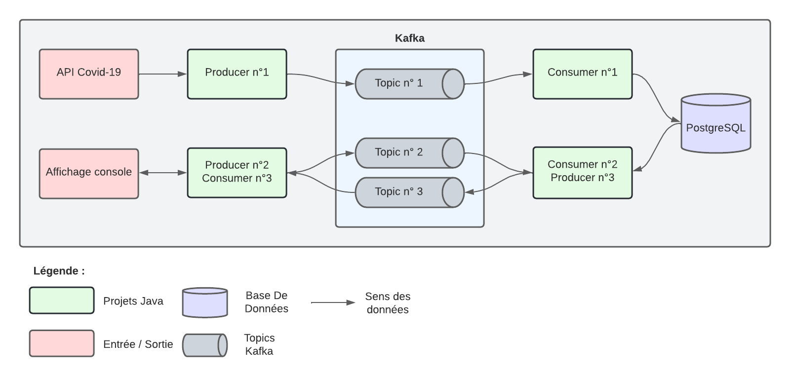
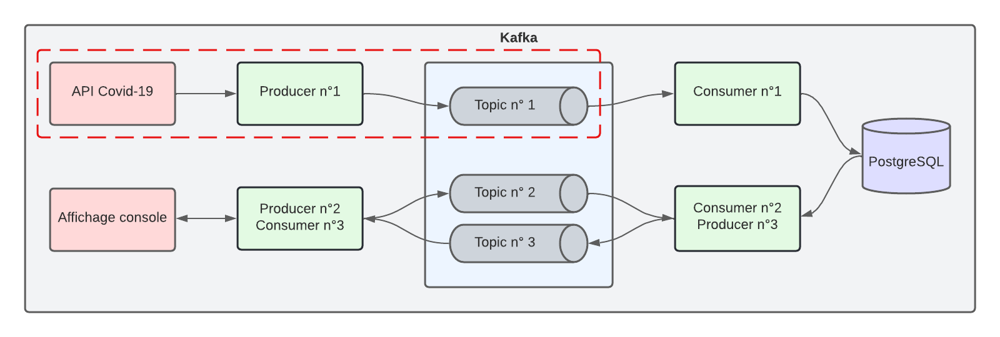
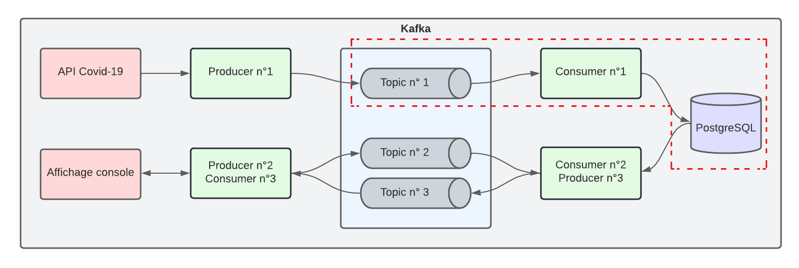
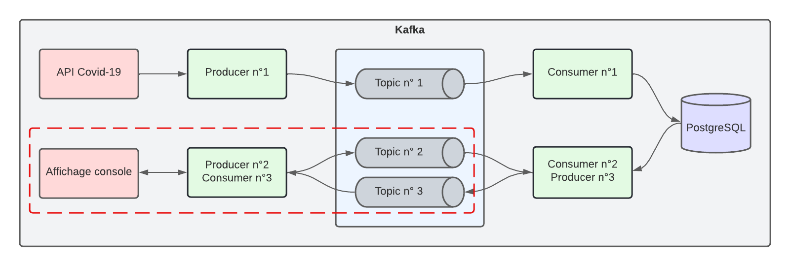
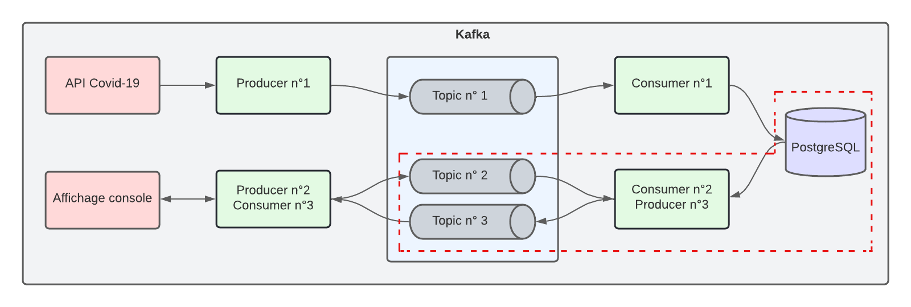
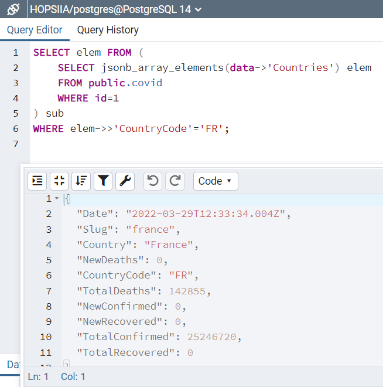

# TP Intergiciel - Kafka

Auteurs : ***Maxence ZOLNIERUCK*** & ***Josue VIDREQUIN***

## Sommaire

- [TP Intergiciel - Kafka](#tp-intergiciel---kafka)
  - [Sommaire](#sommaire)
  - [Introduction](#introduction)
  - [Commandes](#commandes)
  - [Démarrer les services](#démarrer-les-services)
    - [Topics Kafka](#topics-kafka)
    - [Base de données PostgreSQL](#base-de-données-postgresql)
    - [Consumers & Producers Kafa Java](#consumers--producers-kafa-java)
      - [Problème possible](#problème-possible)
  - [Architecture applicative](#architecture-applicative)
    - [Consumers et Producers](#consumers-et-producers)
      - [Producer n°1 : Récupération des données](#producer-n1--récupération-des-données)
      - [Consumer n°1 : Stockage en base de données](#consumer-n1--stockage-en-base-de-données)
      - [Producer n°2 & Consumer n°3 : Interface client et saisie de commandes](#producer-n2--consumer-n3--interface-client-et-saisie-de-commandes)
      - [Consumer n°2 & Producer n°3 : Interrogation de la base de données et calculs](#consumer-n2--producer-n3--interrogation-de-la-base-de-données-et-calculs)
    - [Base de données](#base-de-données)
    - [Format des données](#format-des-données)

## Introduction

Ce dépôt GitHub fait office de rendu de projet dans le cadre du module Intergiciel à l'INSA Hauts-de-France. Le but de ce projet est d'utiliser un bus de messages Kafka afin de faire communiquer plusieurs projets Java. L'application finale est utilisable via ligne de commandes et restitue plusieurs informations et statistiques calculés grâce aux données de l'API publique <https://api.covid19api.com>.

> Vous pouvez visualiser les données de cette API dans ce [fichier](covid_api.json).

Parmis les valeurs que nous restituons, nous retrouvons : le nombre total de cas confirmés, le nombre total de personnes décédées, le nombre de nouveaux cas, le nombre de nouveaux décès et enfin, le nombre de personnes rétablies. Ces données sont regroupées soit par pays, soit à l'international avec des valeurs cumulées.

Toutes les données (sauf pour l'export) sont retournées à l'utilisateur au format Json.

## Commandes

Voici les commandes supportées par l'application :

- **help** : affiche les commandes disponibles.
- **get_global_values** : affiche les valeurs cumulées de tous les pays.
- **get_country_values V_PAYS** : affiche les données spécifiques à un pays. Exemple : V_PAYS=FR
- **get_confirmed_avg** : affiche une moyenne des cas confirmés.
- **get_deaths_avg** : affiche une moyenne des décès.
- **get_countries_deaths_percent** : affiche le pourcentage de décès par rapport aux cas confirmés par pays.
- **export** : affiche une extraction de la base de données au format XML.

Ci dessous, le résultat de l'exécution de la commande **help** :

Un exemple de retour de commande avec **get_country_values FR** :

## Démarrer les services

Le projet est composé grossièrement de trois blocs :

1. Les topics Kafka
2. La base de données PostgreSQL
3. Les projets Java (Consumers & Producers Kafka)

Nous allons voir comment lancer le projet, pas à pas. Il y a à votre disposition des [Scripts](./Scripts) qui vous aideront dans ce processus.

Il est important de suivre les étapes dans l'ordre car il y a une certaine logique dans le branchement des différentes parties.

### Topics Kafka

Tout d'abord, il vous faut avoir installé Kafka sur votre PC. Pour notre part, nous l'avons installé sur Windows 11 sur `C:\Kafka`.

Si vous rencontrez des problèmes pour l'installation de Kafka, nous vous recommandons ce tutoriel que nous avons suivi pour ce TP : <https://www.geeksforgeeks.org/how-to-install-and-run-apache-kafka-on-windows/>

Une fois Kafka installé, vous pouvez utiliser le script [demarrage_kafka_zookeeper.bat](./Scripts/demarrage_kafka_zookeeper.bat) afin de démarrer les services `Kafka` et `Zookeeper`.

Maintenant, nous allons passer à la création des topics qui seront utilisés par les applications Java. Pour cela, le script [creation_topics_kafka.bat](./Scripts/creation_topics_kafka.bat) a été créé.

Finalement, après avoir démarré Kafka et créé les topics, nous pouvons tester le bon fonctionnement des scripts avec la commande :

> C:\Kafka\bin\windows\kafka-topics.bat --bootstrap-server localhost:9092 --describe --topic TOPIC_NAME

Où TOPIC_NAME peut prendre les valeurs : topic1, topic2 et topic3.

Bien, nous avons passé la première étape, intéressons nous maintenant à la base de données PostgreSQL.

### Base de données PostgreSQL

Pour ce projet nous utilisons une base de données PostgreSQL car elle permet de stocker des valeurs au format Json directement. Chose très utile pour nous qui utilisons une API publique nous retournant les valeurs au format Json. De ce fait, après quelques traitements, nous pouvons directement stocker le resultat de l'appel dans la base de données.

Nous avons utilisé une image docker pour heberger notre base de données. Vous pouvez retrouver le [docker-compose.yml](docker-compose.yml) a la racine de ce repértoire pour lancer vous même l'image docker.

La base de données sera accessible via l'adresse `http://localhost:5432/HOPSIIA`.

Ensuite, vous pouvez utiliser l'outil [pgAdmin](https://www.pgadmin.org/) mis à disposition par PostgreSQL afin d'administrer vos bases de données.

Maintenant que la base de données a été créée, il faut instancier la table qui accueillera les données de l'API Covid-19. Pour cela, vous avez à votre disposition le script [creation_table_postgres.sql](./Scripts/creation_table_postgres.sql) dans ce dépot pour la création de la table **covid**.

Ensuite, il faut initialiser la table avec un enregistrement vide. Pour cela, exécutez la requête qui se trouve dans [initialiser_table_postgres.sql](./Scripts/initialiser_table_postgres.sql).

Le second point de ce projet est prêt. Cette base de données sera alimentée grâce à deux projets Java : Cs1 (Consumer 1) et Pr1 (Producer 1) que nous allons aborder dès maintenant.

### Consumers & Producers Kafa Java

Les modules Java sont accessibles dans le dossier [Sources](./Sources/).

Il faut impérativement démarrer les modules dans cet ordre :

1. Producer n°1 ([Pr1](./Sources/pr1/))
2. Consumer n°1 ([Cs1](./Sources/cs1/))
3. Consumer n°2 & Producer n°3 ([Cs2Pr3](./Sources/cs2pr3/))
4. Producer n°2 & Consumer n°3 ([Pr2Cs3](./Sources/pr2cs3/))

Vous pouvez les importer dans le workspace de votre IDE favori (pour nous c'est [Eclipse](https://www.eclipse.org/ide/) 💜) et les lancer dans l'ordre décrit ci-dessus.

Tous les projets ont une classe portant comme nom `XXX`MainClass où `XXX` est le nom du projet. Par exemple : [Pr1MainClass.java](./Sources/pr1/src/main/java/pr1/Pr1MainClass.java). Ce sera ces classes qu'il faut démarrer pour lancer le module.

#### Problème possible

Il est possible que l'export des données n'affiche rien dans la console Eclipse. Si cela est le cas, c'est car Eclipse limite la taille des messages à afficher.

Pour modifier ce paramètre, aller dans `Window > Preferences > Run/Debug > Console` puis redéfinissez les paramètres tels que :

## Architecture applicative

### Consumers et Producers

Les consumers (Cs) et Producers (Pr) sont des applications Kafka permetant d'écrire dans un topic pour un Pr et de lire les messages pour un Cs. Dans notre projet, il y a 4 "briques" :

- Pr1 : Lit les messages de l'API Covid
- Cs1 : Mets à jour la base de données
- Pr2Cs3 : L'invité de commande utilisé pour saisir les commandes
- Cs2Pr3 : Communique avec la base de données et effectue des traitements spécifiques à la demande utilisateur reçue

Ces briques Kafka communiquent entre elles via les topics créés précédemment à la section [Topics Kafa](#topics-kafka).

Pour un peu plus de clareté, voici un schéma de l'architecture applicative de notre projet :

#### Producer n°1 : Récupération des données

Ce projet fait un appel automatisé toutes les 30 minutes via la librairie [Quartz Scheduler](http://www.quartz-scheduler.org/) à l'[API Covid-19](https://api.covid19api.com). A chaque fois que le projet récupère les données de l'API, nous effectuons un léger traitement pour épurer le JSON en supprimant certains champs qui ne nous intéressent pas ici. Ensuite, le Json nouvellement créé est envoyé dans le topic n°1.

#### Consumer n°1 : Stockage en base de données

Du côté Consumer n°1, le module est en attente constante de nouveaux messages à lire dans le topic n°1. Quand un message est détecté, le module en récupère le contenu et effectue une connexion à la base de données pour envoyer la mise à jour des données.

#### Producer n°2 & Consumer n°3 : Interface client et saisie de commandes

Le module le plus lourd est celui-ci étant donné qu'il embarque à la fois : une partie consumer, une partie producer et une partie invité de commande pour que l'utilisateur saisisse ses requêtes. Cependant, son fonctionnement est assez simple. Après avoir demandé à l'utilisateur la commande qu'il souhaite exécuter, le module vérifie que celle-ci est bien valide et qu'elle pourra être exécutée côté [Cs2Pr3](#cs2pr3) sans aucun soucis. Ensuite, la commande est envoyée via le topic n°2 et sera exécutée par l'autre module. Lorsque la requête aura été exécutée, notre module récupèrera le résultat dans le topic n°3 afin de l'afficher à l'écran pour l'utilisateur.

#### Consumer n°2 & Producer n°3 : Interrogation de la base de données et calculs

Ce module fait office d'interface avec la base de donnée et de brique de calcul. En effet, ce module lit des commandes utilisateurs à travers le topic n°2 qu'il transcode en requête SQL pour intérroger la base de données. Une fois les données reçues, un enchainement de calculs est exécuté pour répondre à la demande utilisateur. Enfin, ce resultat est communiqué au module appelant via le topic n°3.

### Base de données

La base de données PostgreSQL comporte une unique table appelée `covid`. Dans cette table se trouve trois colonnes :

| covid.id         | covid.data               | covid.date_update                                  |
|------------------|--------------------------|----------------------------------------------------|
| identifiant fixe | données de l'API en Json | Date et heure à la quelle la BDD a été mise à jour |

Lorsque le [Cs1](#consumer-n1--stockage-en-base-de-données) souhaite effectuer une mise à jour de la base de données, il va dans les faits venir écraser le seul enregistrement. Pour cela, l'enregistrement possède un identifiant unique : `covid.id = 1`.

De ce fait, la requête SQL exécutée par le [Cs1](#consumer-n1--stockage-en-base-de-données) pour mettre à jour la base de données est la suivante :

> UPDATE public.covid SET data=`?1`, date_update=`?2` WHERE **id=1**;

Nous voyons bien que les données contenues dans l'enregistrement portant l'identifiant n°1 seront écrasées par les nouvelles.

Le champ `data` dans la base de données est au format [JsonB](https://www.postgresql.org/docs/13/datatype-json.html). Cela nous permet d'exécuter des requêtes tout en profitant des avantages du Json. Par exemple, pour la commande `get_country_values V_PAYS`, voici le type de requête exécutée :

### Format des données

Les données de l'API ne sont considérées comme Json uniquement à partir du moment où elles sont stockées en base de données. Avant cela, dans le Producer n°1, dans le topic n°1 et dans le Consumer n°1, l'appel à l'API Covid-19 est récupéré comme une chaine de caractères à part entière. Le fait de le convertir en Json une foi en base de données nous permet d'effectuer des requêtes plus performantes et plus précises. Cela nous évite également de la compléxité au niveau des modules Pr1 et Cs1.
